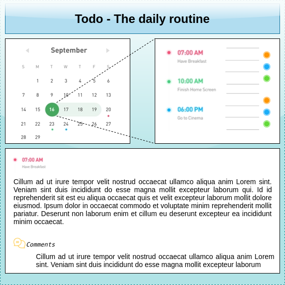
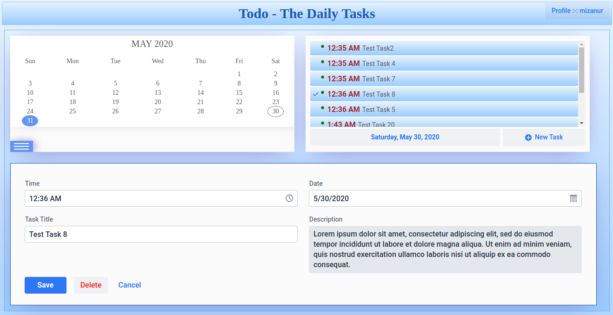
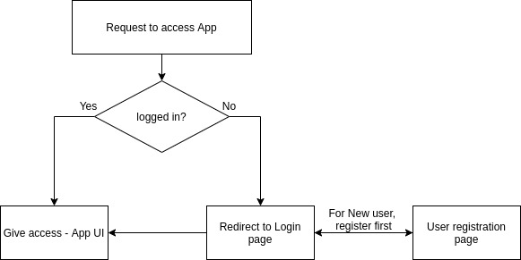

# Daily-Todo
Daily Todo app - developed using vaadin and spring boot


## Initial plan to have UI design as following:




## Developed UI snap




## Application flow diagram





## Technological Stack

1. Spring boot  version 2.2.0
2. Spring security
3. Vaadin version 14
4. PostgreSQL
5. Evo-Calendar - a jquery  library. 


## User Manual: 
Please find here with the [user manual](./y-info/User-Manual_Daily-Task.pdf)


## Future Release Item
1. **View Task in static mode section:**  Currently in task descriptor, add/edit task page is shown. In future it will be a task view page. user will see a static task view. In task view page, there will be some buttons like edit, delete, add comment.
2. **Comment section:** In future release, There will a comment section in task descriptor. When user clicks on add comment in task descriptor, he/she will get a field to add comments under a certain task. Multiple comments can be added under a task. 
3. **Global Exception Handler:** No global exception handler is added in current release. There will be added a global exception handler in future release. 
4. **Responsive UI: ** In future release, UI will be 100% responsive. 


## Running The Application:

1. Open application.properties file placed in resource folder and edit following db related properties
   
   ```
   spring.datasource.url=jdbc:postgresql://localhost:5432/tododb
   spring.datasource.username=todo
   spring.datasource.password=pass
   ```

2. For the first time run in your environment, please keep the below property in application.properties file as follows to create db tables in db:
   ```
   spring.jpa.hibernate.ddl-auto=create
   ```
   
3. Run the project with below command:

   ```
   mvn spring-boot:run
   ```
