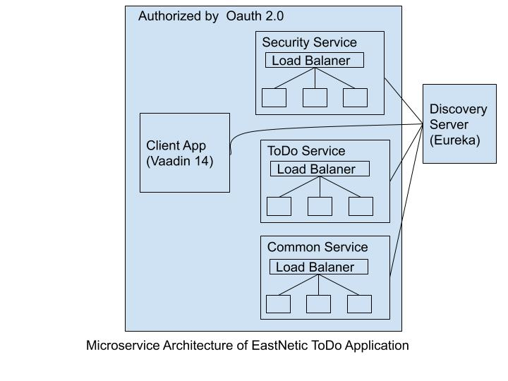

# ToDoApp Project Architecture

Technology: Java 8, Spring Boot, Spring Cloud, Spring Cloud Netflix, Spring security, Oauth 2.0, Liquibase, Vaadin 14.

References 
1. https://developer.okta.com/blog/2018/02/13/secure-spring-microservices-with-oauth
2. https://developer.okta.com/blog/2017/06/15/build-microservices-architecture-spring-boot

# ToDoApp

This is the job interview task for software developer position

## What to do
* Fork the repository
* After work is done, make a pull request and notify me by email

## Task description
You need to make a Todo app with these requirements:
1. Page for listing all the todo items
2. Todo item add and edit forms (separate pages)
3. Todo item consists of (date, item name and description)
4. Pages must interact between each other logically. (You can go from list to new or edit and when saving go back to list)

All the other specific requirements are up to you

## Technical requirements
* Use any frontend framework but Vaadin (https://vaadin.com/) is strongly recommended and would be a huge benefit
* For backend use Java EE
* Use any database (Postgres, Oracle, etc.)
* Make a Maven project

## Main points
* Structure your code
* Use best practises
* Use naming conventions
* Show understanding of software development concepts
